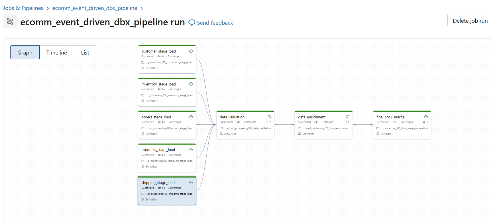

# E-Commerce Incremental Data Load — Databricks ETL Pipeline

Event-driven ETL pipeline that ingests raw e-commerce CSV files, validates
and enriches them across 5 domains, and produces SCD Type 2 target tables
with business analytics summaries.

---

## Tech Stack
`Databricks` · `PySpark` · `Delta Lake` · `Unity Catalog` · `Databricks Volumes`

---

## Pipeline Architecture

<!-- 
  HOW TO ADD IMAGE:
  1. Upload your image to the images/ folder in your GitHub repo
  2. The line below automatically picks it up — no changes needed
  3. If image doesn't show, check the filename matches exactly
-->



---

## Project Structure
ecomm-etl-pipeline/

├── notebooks/

│   ├── 01_orders_stage_load.py         #Ingest & validate orders

│   ├── 02_customers_stage_load.py      # Ingest & validate customers

│   ├── 03_products_stage_load.py       # Ingest & validate products

│   ├── 04_inventory_stage_load.py      # Ingest & validate inventory

│   ├── 05_shipping_stage_load.py       # Ingest & validate shipping

│   ├── 06_data_validation.py           # Cross-reference & business rules

│   ├── 07_data_enrichment.py           # Join all domains, build analytics

│   └── 08_final_merge_operation.py     # SCD2 merge + summary tables

├── configs/

│   └── pipeline_config.py              # All paths, table names, business rules

├── utils/

│   └── pipeline_utils.py               # Shared helpers — logging, archiving, SCD2

├── images/

│   └── pipeline_architecture.png       # Pipeline screenshot (shown above)

├── Old - notebooks/ #Without utils generic code

└── README.md

---

## Setup

**1. Clone repo into Databricks Repos**
Workspace → Repos → Add Repo → paste GitHub URL

**2. Update catalog and schema** in `configs/pipeline_config.py`
```python
CATALOG = "your_catalog"
SCHEMA  = "your_schema"
```

**3. Update `sys.path`** in each notebook (line 2) with your actual Repos path
```python
sys.path.append("/Workspace/Repos/your.email@company.com/ecomm-etl-pipeline")
```

**4. Run notebooks 01–05 individually first**, then 06 → 07 → 08 to verify each step.

**5. Create Databricks Job** — set 01–05 to run in parallel, then 06 → 07 → 08 sequentially.

---

## Job Task Dependencies

| Task | Depends On |
|---|---|
| 01 – 05 (stage loads) | — (run in parallel) |
| 06 data_validation | 01, 02, 03, 04, 05 |
| 07 data_enrichment | 06 |
| 08 final_scd2_merge | 07 |

---

## Author
Built as a portfolio project — feel free to [connect on LinkedIn!](https://www.linkedin.com/in/padamatihemanth/)
